<div align="center">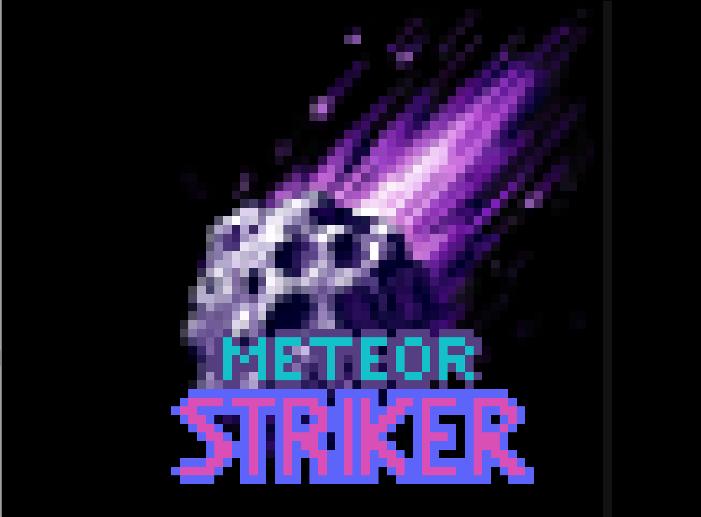</div>

<h3 align="center">Meteor Striker</h3>

<p align="center">Meteor Striker é um jogo multiplayer para a placa DE1-SoC desenvolvido em C. Um driver em Assembly, criado para uma GPU customizada desenvolvida por outro autor e instalada na FPGA, controla a exibição de imagens na saída VGA. O jogo é controlado via mouse e acelerômetro. Dois jogadores interceptam meteoros e acumulam pontos em uma tela dividida.</p>

<div align="center">
	
[Sobre o projeto](#sobre-o-projeto) • [Instalação](#instalação) • [Solução geral](#solução-geral) • [O jogo](#o-jogo) • [Testes](#testes)

</div>

## Sobre o projeto

Durante a evolução dos videogames, jogos como <i>Breakout Story</i> demonstraram como gráficos simples e mecânicas interativas podem criar experiências memoráveis. Inspirado nesse conceito, <i>Meteor Striker</i> é um jogo bidimensional multiplayer, <i>desenvolvido em Linguagem C</i>, onde dois jogadores competem interceptando meteoros. Desenvolvido para a <i>DE1-SoC</i>, o projeto utiliza uma <i>GPU customizada criada por Gabriel Sá Barreto Alves</i>, ex-aluno do curso de Engenharia de Computação da UEFS, como parte de seu TCC. Essa GPU, instalada na FPGA, é controlada por <i>um driver em Assembly desenvolvido especialmente para o jogo</i>. Com controles via acelerômetro e mouse, o projeto explora a interação entre hardware e software, destacando a integração entre <i>HPS</i> e <i>FPGA</i> e o uso de representações gráficas avançadas para criar uma experiência imersiva e competitiva.

<details>
  <summary><b>Requisitos</b></summary>

### Requisitos
O problema a ser desenvolvido no Kit de desenvolvimento DE1-SoC deve atender às seguintes restrições:

- O código deve ser escrito em linguagem C e a biblioteca do Processador Gráfico em Assembly;
- O sistema só poderá utilizar os componentes disponíveis na placa DE1-SoC;
- Deverá utilizar todas as funções implementadas na biblioteca do Processador Gráfico e, no mínimo, um novo sprite deve ser colocado na memória e utilizado no jogo;
- Os dois jogadores devem jogar simultaneamente utilizando obrigatoriamente o acelerômetro, e adicionalmente o mouse;
- A variação da velocidade no movimento deve ser refletida na ação do ator do jogo, como no exemplo do jogo Breakout, onde a barra se move com velocidade maior se o movimento do mouse for brusco;
- Informações do jogo (placar, vidas, etc.) devem ser exibidas na tela do jogo;
- O jogo deve permitir ações do usuário através dos botões da DE1-SoC, incluindo pausa, retorno, reinício e término do jogo:
  - O usuário poderá parar e reiniciar o jogo a qualquer momento;
  - O usuário poderá sair do jogo a qualquer momento;
- Pelo menos dois elementos passivos do jogo deverão se mover de maneira independente;
- Jogos de tabuleiro e/ou turno (xadrez, dama, etc.), tetris e jogo da forca e da velha estão vetados, e cada grupo deverá desenvolver um jogo diferente dos demais.

</details>

<details>
  <summary><h2>Índice</h2></summary>

- [Instalação](#instalação)
  - [Pré-requisitos](#pré-requisitos)
- [Softwares utilizados](#softwares-utilizados)
  - [Linguagem C](#linguagem-c)
  - [Linguagem Assembly](#linguagem-assembly)
  - [Compilador GCC](#compilador-gcc)
  - [VS Code](#vs-code)
- [DE1-SoC](#kit-de-desenvolvimento-de1-soc)
  - [Visão geral da DE1-SoC](#visão-geral-da-de1-soc)
  - [Sistema computacional da placa](#sistema-computacional-de1-soc)
- [Processador gráfico desenvolvido por Gabriel Sá Barreto Alves](#processador-gráfico-desenvolvido-por-gabriel-sá-barreto-alves)
  - [Como funciona?](#como-funciona)
- [Dispositivos de Entrada Usados](#dispositivos-de-entrada-usados)
  - [Mouse USB](#mouse-usb)
  - [Biblioteca para Acelerômetro ADXL345 na DE1-SoC](#biblioteca-para-acelerômetro-adxl345-na-de1-soc)
  - [Botões push](#botões-do-tipo-push)
- [O Jogo](#o-jogo)
  - [Interface do Jogo](#interface-do-jogo)
  - [Elementos do jogo](#elementos-do-jogo)
  - [Como jogar](#como-jogar)   
- [Solução geral](#solução-geral)
- [Gerenciamento da GPU](#gerenciamento-do-processador-gráfico)
  - [Mapeamento da Memória FPGA](#mapeamento-da-memória-fpga)
  - [Comunicação com as Filas FIFO A e FIFO B](#comunicação-com-as-filas-fifo-a-e-fifo-b)
  - [Representação Gráfica](#representação-gráfica)
  - [Funções Detalhadas](#funções-detalhadas)
  - [Pontos Relevantes](#pontos-relevantes)
- [Threads e kthreads](#threads-e-kthreads)
  - [Threads](#threads)
  - [Kthreads - Kernel Threads](#kthreads---kernel-threads)
  - [Modelo de Threads](#modelo-de-threads)
  - [Vantagens das Threads](#vantagens-das-threads)
  - [Desafios das Threads](#desafios-das-threads) 
- [Gerenciamento dos pushbuttons](#gerenciamento-dos-pushbuttons)
  - [Driver dos botões](#driver-dos-botões)
  - [Biblioteca dos botões](#biblioteca-dos-botões)
  - [Inicialização dos Botões](#inicialização-dos-botões)
  - [Leitura do Estado dos Botões](#leitura-do-estado-dos-botões)
  - [Fechamento e Liberação](#fechamento-e-liberação)
  - [Exemplo de Utilização](#exemplo-de-utilização)
  - [Notas Importantes](#notas-importantes)
- [Algoritmos do Jogo](#algoritmos-do-jogo)
  - [Criação de Sprites](#criação-de-sprites)
  - [Movimento e ações do jogador](#movimento-e-ações-do-jogador)
  - [Geração dos meteoros](#geração-dos-meteoros)
  - [Detecção de colisão](#detecção-de-colisão)
  - [Movimentação de elementos](#movimentação-de-elementos)
    - [Movimentação do plano de fundo](#movimentação-do-plano-de-fundo)
    - [Movimentação dos meteoros](#movimentação-dos-meteoros)
  - [Fluxo do jogo](#fluxo-do-jogo)
    - [Controle do fluxo da execução das threads](#controle-do-fluxo-da-execução-das-threads)
      - [Criação e finalização das threads](#criação-e-finalização-das-threads)
- [Testes](#testes)
  - [Polling dos botões](#polling-dos-botões)
  - [Jogo](#jogo)
- [Conclusão](#conclusão)

</details>


## Instalação

<details>
  <summary><h3>Pré-requisitos</h3></summary>

### Pré-requisitos

- Possuir conexão com internet;
- Possuir instalado o compilador GCC;
- Possuir instalado o Git;
- Utilizar uma placa de desenvolvimento FPGA DE1-SoC;
- Possuir o processador gráfico desenvolvido por Gabriel Sá Barreto Alves na FPGA;
- Possuir um monitor conectado à placa por meio da saída VGA;
- Possuir um mouse USB conectado à placa.

</details>


### Compilação e Execução do jogo

#### 1. Clonar o repositório
Abra o terminal do seu dispositivo e execute o seguinte comando:
```bash
git clone https://github.com/alexsami-lopes/Digital-Systems-Meteor-Striker.git
```
**Transfira os arquivos do projeto para a placa DE1-SoC.**

#### 2. Na placa, acessar a pasta */Digital-Systems-Meteor-Striker-main* e compilar o jogo
Para acessar a pasta e compilar o jogo, execute os seguintes comandos:
```bash
cd /Digital-Systems-Meteor-Striker-main
make
```

#### 3. Executar o jogo
Na placa, dentro da pasta */Digital-Systems-Meteor-Striker-main*, execute o comando:
```bash
sudo ./meteor_striker
```
Ou ainda:
```bash
make execute
```


## Softwares utilizados

<details>
  <summary><b>Linguagem C</b></summary>

### Linguagem C

A linguagem C é descrita como "uma linguagem de propósito geral com recursos de economia de expressão, controle de fluxo moderno e estruturas de dados, e um rico conjunto de operadores" (Kernighan & Ritchie, 1978). Embora não seja uma linguagem de "alto nível", sua generalidade a torna eficaz para muitas tarefas.

</details>

<details>
  <summary><b>Linguagem Assembly</b></summary>

### Linguagem Assembly

A linguagem Assembly é uma linguagem de programação de baixo nível que representa uma abstração mnemônica direta para as instruções de máquina de um processador específico. Ela permite aos programadores interagir diretamente com o hardware de forma mais próxima do que as linguagens de alto nível.

</details>

<details>
  <summary><b>Compilador GCC</b></summary>

### Compilador GCC

O GCC (GNU Compiler Collection) é um conjunto de compiladores de código aberto desenvolvido pelo Projeto GNU, sendo uma ferramenta fundamental no desenvolvimento de software para sistemas Unix-like e outros sistemas operacionais.

#### Características Principais
- **Multiplataforma**: Suporta diversos sistemas operacionais e arquiteturas de processador
- **Linguagens Suportadas**: C, C++, Objective-C, Fortran, Ada, Go
- **Otimização de Código**: Oferece múltiplos níveis de otimização de desempenho

#### Flags de Compilação Comuns

##### CFLAGS Explicadas
- `-Wall`: Habilita todos os avisos do compilador
- `-std=gnu99`: Define o padrão de linguagem C como GNU99
- `-Wextra`: Adiciona avisos extras além dos habilitados por `-Wall`
- `-pthread`: Adiciona suporte para programação multithread

Exemplo de uso das CFLAGS:
```bash
gcc -Wall -std=gnu99 -Wextra -pthread programa.c -o programa
```

##### Bibliotecas Comuns
- `-lintelfpgaup`: Biblioteca para desenvolvimento com FPGAs da Intel
- `-lm`: Biblioteca matemática padrão do C

Exemplo de compilação com bibliotecas:
```bash
gcc -Wall -std=gnu99 -Wextra -pthread programa.c -o programa -lintelfpgaup -lm
```

#### Exemplos de Uso Completo

Compilação com todas as flags e bibliotecas:
```bash
gcc CFLAGS programa.c -o programa LIBS
```

Ou de forma expandida:
```bash
gcc -Wall -std=gnu99 -Wextra -pthread programa.c -o programa -lintelfpgaup -lm
```

#### Níveis de Otimização
- `-O0`: Sem otimização (padrão)
- `-O1`: Otimização básica
- `-O2`: Otimização recomendada
- `-O3`: Otimização agressiva
- `-Os`: Otimização para tamanho do código

#### História
Criado por Richard Stallman em 1987, inicialmente como um compilador para C, o GCC evoluiu para se tornar uma coleção robusta de compiladores multi-linguagem, sendo crucial para o desenvolvimento de software livre.

</details>

<details>
  <summary><b>VS Code</b></summary>

### VS Code

O Visual Studio Code (VS Code) é um editor de código-fonte desenvolvido pela Microsoft, gratuito e de código aberto. Multiplataforma, suporta Windows, Linux e macOS, sendo popular entre desenvolvedores por sua leveza, versatilidade e grande ecossistema de extensões.

#### Principais Características
- **Gratuito e Open Source**: Desenvolvimento contínuo pela comunidade
- **Suporte Multilinguagem**: Recursos avançados para diversas linguagens de programação
- **Extensões**: Marketplace com milhares de complementos
- **Depuração Integrada**: Ferramentas de debug nativas
- **Controle de Versão**: Integração nativa com Git

#### Recursos Principais
- Autocompletar inteligente
- Realce de sintaxe
- Depuração integrada
- Terminal incorporado
- Git integrado
- Customização via temas e configurações

Acesse [documentação oficial programa](https://code.visualstudio.com/docs#vscode)

</details>


## Kit de desenvolvimento DE1-SoC

### Visão geral da DE1-SoC

A DE1-SoC é uma plataforma de desenvolvimento de sistemas embarcados projetada pela Terasic, baseada em um System on Chip (SoC) que integra um processador ARM Cortex-A9 dual-core e um FPGA Altera Cyclone V.

#### Características principais:
- **Processador**: ARM Cortex-A9 dual-core.
- **FPGA**: Altera Cyclone V (5CSEMA5F31C6).
- **Memória**: 
  - 1 GB DDR3.
  - 256 MB SDRAM.
- **Conectividade**:
  - Ethernet.
  - USB.
  - Entrada de áudio/vídeo.
  - Interface GPIO.

#### Recursos de Hardware:
- Displays de 7 segmentos.
- Chaves e botões programáveis.
- LEDs.
- Conectores de expansão.
- Suporte para desenvolvimento de sistemas embarcados e prototipagem de circuitos digitais.

<div align="center">
  <figure>  
    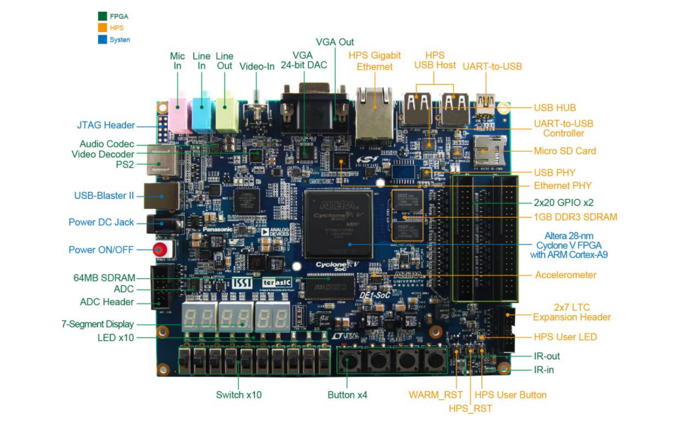
    <figcaption>
      <p align="center"> 

[**Figura 1** - Manual de Usuário da Placa DE1-SoC](https://fpgacademy.org/Downloads/DE1_SoC_User_Manual.pdf)

</p>
    </figcaption>
  </figure>
</div>


<details>
  <summary><b>Sistema computacional DE1-SoC</b></summary>

### Sistema computacional DE1-SoC

<div align="center">
  <figure>  
    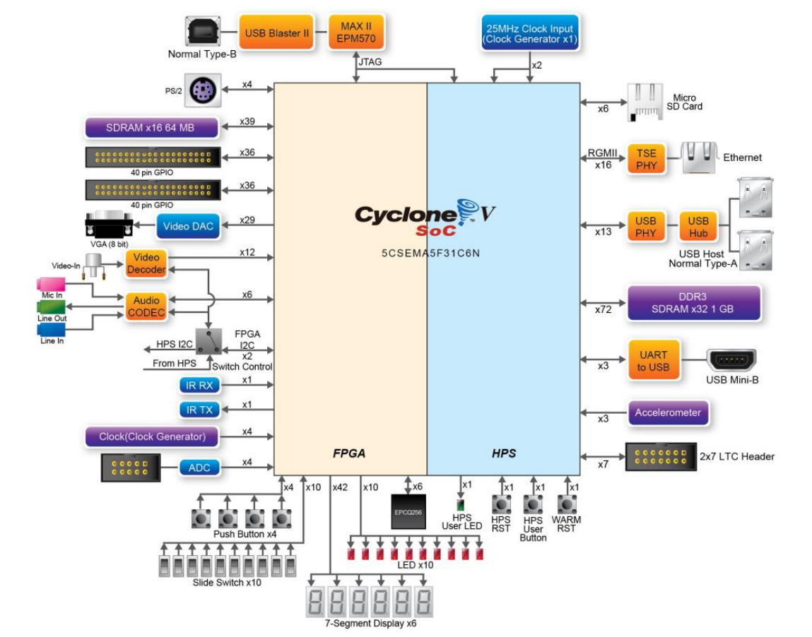
    <figcaption>
      <p align="center">

[**Figura 2** - Diagrama de Blocos da DE1-SoC](https://fpgacademy.org/Downloads/DE1_SoC_User_Manual.pdf)

</p>
    </figcaption>
  </figure>
</div>

O diagrama de blocos do sistema computacional, apresentado na figura 2, explicita os componentes do Cyclone® V da Intel®, bem como suas conexões. O HPS inclui um processador ARM® Cortex-A9 MPCore™ de 2 núcleos com uma distribuição Linux embarcada destinada a processamentos de propósito geral, além da memória DDR3 e dos dispositivos periféricos. Já a FPGA possibilita uma variedade de implementações através da programação dos blocos lógicos.

> A comunicação bidirecional entre o HPS e a FPGA se dá por meio das *FPGA bridges*. No sentido HPS-FPGA, todos os dispositivos de entrada e saída (E/S) conectados à FPGA são acessíveis ao processador através do mapeamento de memória. As informações sobre o **endereçamento original** dos periféricos estão disponíveis na [documentação da placa](https://fpgacademy.org/index.html).

</details>


## Processador Gráfico Desenvolvido por Gabriel Sá Barreto Alves

O processador gráfico desenvolvido por Gabriel Sá Barreto Alves permite mover e controlar elementos em um monitor VGA com resolução de 640×480 pixels. Este processador possibilita o desenho de dois tipos de *polígonos* convexos (quadrado e triângulo) e uma quantidade determinada de *sprites*. Durante o desenvolvimento, Gabriel utilizou como unidade de processamento principal o NIOS II, embarcado na mesma FPGA que o processador gráfico. A figura 3 ilustra a arquitetura desenvolvida.

<details>
  <summary><b>Como funciona?</b></summary>

### Como funciona?

O dispositivo gráfico oferece um conjunto de instruções para gerenciar polígonos, sprites e o background. Mais detalhes sobre essas instruções podem ser encontrados [aqui](https://drive.google.com/file/d/1MlIlpB9TSnoPGEMkocr36EH9-CFz8psO/view). Essas instruções são transmitidas do HPS para o hardware na FPGA por meio dos barramentos *dataA* (responsável pelos dados de acesso à memória e registradores, além dos *opcodes*) e *dataB* (que recebe dados customizáveis como cores e posições).

Os dados nos barramentos são gravados nas filas de instruções A e B (correspondentes aos barramentos *dataA* e *dataB*). As FIFOs armazenam até 16 palavras de 32 bits cada. Para garantir a escrita correta nas filas, foram usados os seguintes sinais de controle:
- *wr_reg (input)*: sinal de escrita nas FIFOs.
- *wr_full (output)*: sinal que indica que as filas estão cheias.

A escrita nas FIFOs pode ocorrer apenas quando a fila não está cheia. Durante esse período, o sinal *wr_reg* pode ser ativado ao armazenar 1 no endereço *#0xc0 a partir do endereço base mapeado*. A escrita pode continuar até que o sinal *wr_full* seja ativado (indicando filas cheias). O código abaixo ilustra esse comportamento:

```asm
check_fifo:            @ Função que verifica se a FIFO está cheia
  sub sp, sp, #8       @ Reservando 8 bytes na pilha
  str r0, [sp, #4]
  str r1, [sp, #0]
  
  ldr r0, =mapped_address   @ Endereço mapeado
  ldr r0, [r0]
checking:                   @ Label para verificar se a FIFO está cheia
  ldr r1, [r0, #0xb0]       @ Lendo o registrador de status da FIFO
  CMP r1, #1                @ Comparando o status da FIFO com 1
  beq checking              @ Se a FIFO estiver cheia, volta para o label checking

  ldr r0, [sp, #4]
  ldr r1, [sp, #0]
  add sp, sp, #8 
  
  bx lr
```

O código para enviar uma instrução para a GPU pode ser conferido abaixo:

```asm
sendInstruction:
    @ r0 -> data_a
    @ r1 -> data_b

    sub sp, sp, #40       @ Reservando 40 bytes na pilha
    str lr, [sp, #36]     @ Salvando LR
    str r11, [sp, #32]    @ Salvando R11 (frame pointer)
    str r1, [sp, #4]      @ Salvando r1 (data_b)
    str r0, [sp, #0]      @ Salvando r0 (data_a)

    ldr r11, =mapped_address   @ Carrega o endereço base mapeado
    ldr r11, [r11]             @ Obtém o ponteiro do FPGA

    

    @ Desabilitando a escrita no wrreg
    mov r9, #0                 @ Escreve 0 em wrreg para desabilitar
    str r9, [r11, #wrreg]

    @ Escrevendo DATAA
    str r0, [r11, #data_a]     @ Escreve o opcode e o endereço em data_a

    @ Escrevendo DATAB
    str r1, [r11, #data_b]     @ Escreve data_b

    bl check_fifo              @ Verifica se o FIFO está pronto (implementação separada)

    @ Habilitando a escrita no wrreg
    mov r9, #1                 @ Escreve 1 em wrreg para habilitar
    str r9, [r11, #wrreg]

    @ Finaliza desabilitando o wrreg
    mov r9, #0                 @ Desabilita o wrreg
    str r9, [r11, #wrreg]

    @ Restaurando os registradores
    ldr lr, [sp, #36]          @ Restaura LR
    ldr r11, [sp, #32]         @ Restaura R11
    ldr r1, [sp, #4]           @ Restaura r1
    ldr r0, [sp, #0]           @ Restaura r0

    add sp, sp, #40            @ Libera a pilha
    bx lr                      @ Retorna ao chamador


  bx lr
```

Uma versão em C da biblioteca de controle da comunicação com a GPU foi criada anteriormente para testes, como pode ser conferido um exemplo abaixo de uma delas:

```c
void set_sprite_pixel(int position, unsigned int color) {
    while (*WR_FULL != 0) { /* Aguarda até que WR_FULL esteja em 0 */ }
    *DATA_A = (position << 4) | 0x1;
    *DATA_B = color;
    *WR_REG = 0x01;
    *WR_REG = 0x00;
}

```

Como pode ser visto um código significativamente menor. Muito menos linhas de código são necessárias normalmente em linguagem

<div align="center">
  <figure>  
    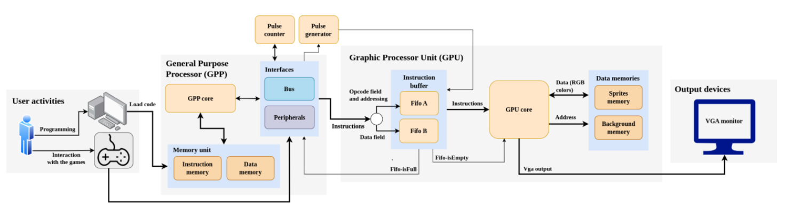
    <figcaption>
      <p align="center">

[**Figura 3** - Representação da arquitetura do processador gráfico](https://drive.google.com/file/d/1ogg3s2YPTvnRmb4YHDygRJ0bcZv8vG-N/view)

</p>
    </figcaption>
  </figure>
</div>

</details>


## Dispositivos de Entrada Usados

Os dispositivos de entrada usados foram:
- 4 botões do tipo push;
- Um mouse conectado via USB para controlar o Player 1;
- O acelerômetro foi usado para controlar o Player 2.

<details>
  <summary><b>Mouse USB</b></summary>

### Mouse USB

Os conectores USB da DE1-SoC são gerenciados por um hub controlador que se comunica diretamente com o HPS. Foi conectado um mouse à primeira porta USB host da placa, conforme ilustrado na Figura 4.

<div align="center">
  <figure>  
    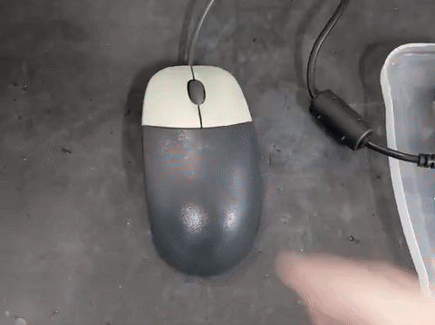
    
<figcaption>

**Figura 4** - Mouse USB usado
    </figcaption>
  </figure>
</div>

</details>

<details>
  <summary><b>Biblioteca para Acelerômetro ADXL345 na DE1-SoC</b></summary>

### Biblioteca para Acelerômetro ADXL345 na DE1-SoC

A biblioteca fornecida contém funções essenciais para configurar e operar o acelerômetro ADXL345 na plataforma DE1-SoC. As principais funções são:

- **Leitura e escrita de registros do ADXL345**:
  - `ADXL345_REG_READ(uint8_t, uint8_t *)`: Lê um byte de um registro específico.
  - `ADXL345_REG_WRITE(uint8_t, uint8_t)`: Escreve um valor em um registro.
  - `ADXL345_REG_MULTI_READ(uint8_t, uint8_t[], uint8_t)`: Lê múltiplos bytes consecutivos de um endereço.

- **Inicialização e leitura de dados**:
  - `ADXL345_init(uint8_t)`: Configura registros como taxa de amostragem e modos de operação.
  - `ADXL345_XYZ_Read(int16_t *)`: Lê valores de aceleração nos eixos X, Y e Z.

A forma de controle através do acelerômetro pode ser conferida na Figura 5.

<div align="center">
  <figure>  
    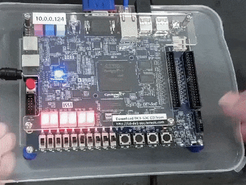
    
<figcaption>

**Figura 5** - Demonstração do uso do acelerômetro ADXL345
    </figcaption>
  </figure>
</div>

</details>

<details>
  <summary><b>Botões do tipo push</b></summary>

### Botões do tipo push

A DE1-SoC oferece quatro botões *push* conectados diretamente à FPGA e à GPU. Esses botões estão associados a um registrador de 32 bits, sendo os 4 bits menos significativos utilizados para armazenar os estados dos botões:
- **KEY0**: bit 0.
- **KEY1**: bit 1.
- **KEY2**: bit 2.
- **KEY3**: bit 3.

Quando um botão é pressionado, o bit correspondente é setado para 0. Quando liberado, o bit retorna a 1.

<div align="center">
  <figure>  
    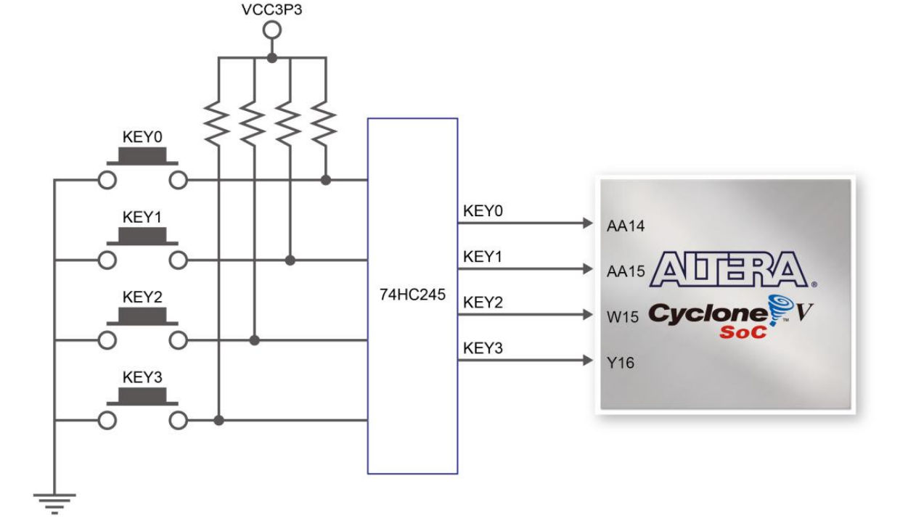
    <figcaption>
      <p align="center">

[**Figura 6** - Circuito dos botões do tipo Push](https://fpgacademy.org/Downloads/DE1_SoC_User_Manual.pdf)

</p>
    </figcaption>
  </figure>
</div>

</details>


## O Jogo

### Interface do Jogo

A seguir, são apresentadas as interfaces exibidas para o jogador no monitor VGA e suas possíveis transições, bem como os cenários em que o uso dos botões interfere no estado do jogo.

- Tela inicial:
<div align="center">
  <figure>  
    
    
<figcaption>

**Figura 7** - Tela inicial
    </figcaption>
  </figure>
</div>

- Tela do menu:
<div align="center">
  <figure>  
    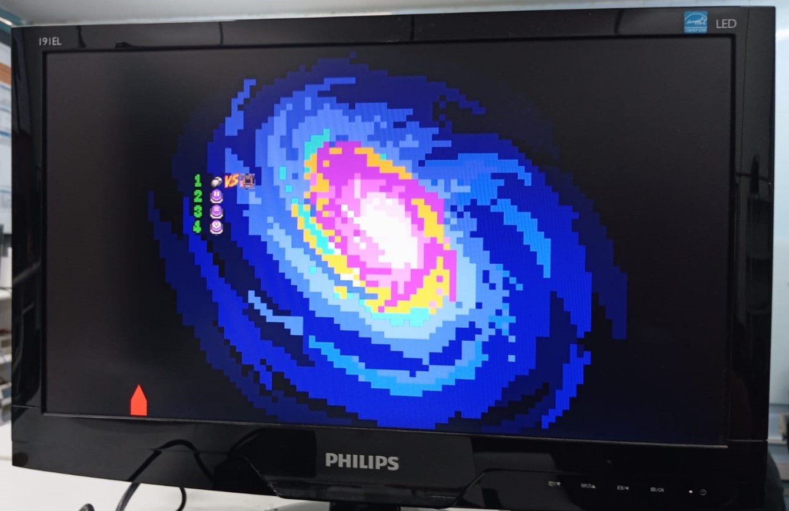
    
<figcaption>

**Figura 8** - Tela do menu em execução
    </figcaption>
  </figure>
</div>

- Partida em execução:
<div align="center">
  <figure>  
    
    
<figcaption>

**Figura 9** - Tela de uma partida em execução
    </figcaption>
  </figure>
</div>

- Tela de pausa:
<div align="center">
  <figure>  
    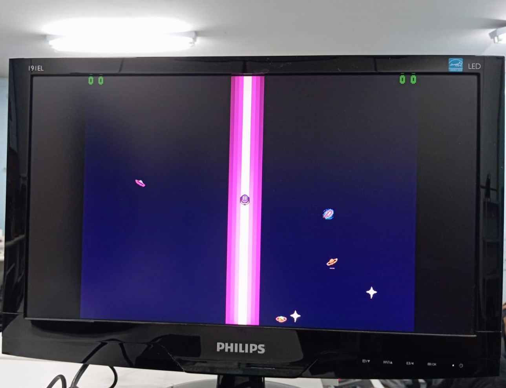
    
<figcaption>

**Figura 10** - Tela de pausa
    </figcaption>
  </figure>
</div>

- Tela de vitória:
<div align="center">
  <figure>  
    
    
<figcaption>

**Figura 11** - Tela de vitória
    </figcaption>
  </figure>
</div>


<details>
  <summary><b>Elementos do Jogo</b></summary>

### Elementos do Jogo

O jogo utiliza sprites para representar elementos como meteoros, alvos, corpos celestes, estrelas, números e elementos do menu. A Figura 12 ilustra um exemplo desses sprites.

<div align="center">
  <figure>  
    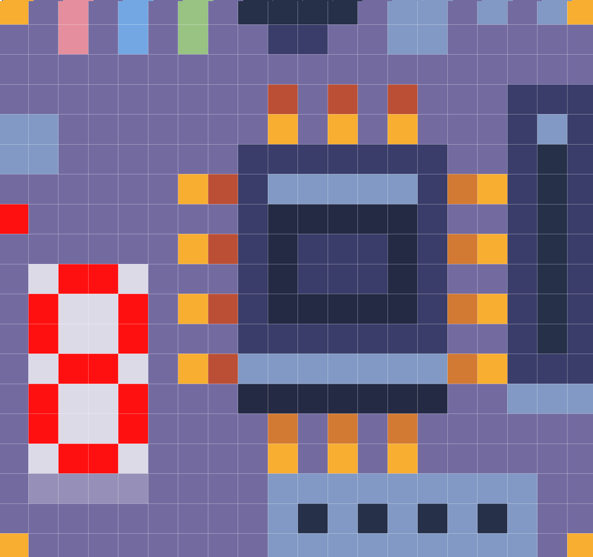
    
<figcaption>

**Figura 12** - Sprite da placa DE1-SoC
    </figcaption>
  </figure>
</div>

</details>

<details>
  <summary><b>Como Jogar</b></summary>

### Como Jogar

Dois jogadores competem para eliminar 10 meteoros antes do adversário. Cada jogador protege metade da tela, e seus alvos eliminam meteoros ao colidir com eles. Pontos são ganhos ao acertar meteoros e perdidos caso meteoros atinjam a parte inferior da tela. O jogador pode usar botões para pausar, reiniciar ou terminar o jogo.

</details>


## Solução Geral

<div align="center">
  <figure>  
    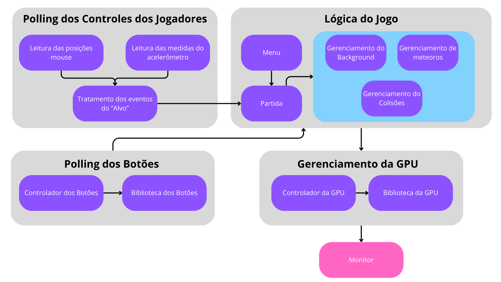
    
<figcaption>

**Figura 13** - Esquema em blocos da solução geral
    </figcaption>
  </figure>
</div>

A aplicação integra módulos para o gerenciamento de hardware (botões, mouse, acelerômetro) e lógica do jogo. Threads específicas são responsáveis por ações como movimentação dos elementos e detecção de colisões.

<details>
  <summary><b>Gerenciamento do Processador Gráfico</b></summary>

### Gerenciamento do Processador Gráfico

O código interage com uma GPU personalizada implementada em FPGA na DE1-SoC para gerenciamento gráfico, permitindo a manipulação do **background**, de **sprites** e **polígonos**. Aqui está uma análise detalhada das funcionalidades descritas:

</details>

<details>
  <summary><b>Mapeamento da Memória FPGA</b></summary>

### Mapeamento da Memória FPGA

O sistema utiliza o driver `/dev/mem` para acessar os registradores da FPGA via o barramento HPS-to-FPGA Lightweight AXI.

#### **Funções Principais**
1. **`open_mem_vgafpga`**:
   - Abre o arquivo `/dev/mem` para leitura e escrita.
   - Chama `mapping_fpga` para mapear os endereços de memória da FPGA para o espaço de usuário.

2. **`mapping_fpga`**:
   - Usa `mmap` para mapear 256 bytes de memória FPGA a partir do endereço base `0xFF200000`.
   - Define ponteiros para os registradores mapeados, como `DATA_A`, `DATA_B`, e `WR_FULL`.

3. **`unmapping_fpga`**:
   - Libera a memória mapeada com `munmap`.

</details>

<details>
  <summary><b>Comunicação com as Filas FIFO A e FIFO B</b></summary>

### Comunicação com as Filas FIFO A e FIFO B

- **Registradores Importantes**:
  - `DATA_A`: Envia dados para a FIFO A.
  - `DATA_B`: Envia dados para a FIFO B.
  - `WR_FULL`: Indica se a fila está cheia (`1`).
  - `WR_REG`: Inicia a transmissão de dados para a GPU.

#### **Funcionamento Geral**
- Antes de enviar dados, o código verifica o estado de `WR_FULL` (se estiver cheio, aguarda).
- Após enviar os dados para `DATA_A` e `DATA_B`, um pulso é enviado para `WR_REG` para iniciar a transferência.

</details>

<details>
  <summary><b>Representação Gráfica</b></summary>

### Representação Gráfica

#### **Cores no Formato BGR (9 bits)**
- Cada cor é representada por:
  - **3 bits para B (azul)**: 0–7.
  - **3 bits para G (verde)**: 0–7.
  - **3 bits para R (vermelho)**: 0–7.
- Exemplo:
  - Cor `0b000000111` representa apenas vermelha no máximo.

#### **Background (Tela 640x480)**
- O **background** é dividido em **4800 quadrados de 8x8 pixels**.
- A função `draw_square_8x8`:
  1. Calcula a posição do quadrado na memória da GPU.
  2. Envia a posição e a cor para as FIFOs.
  3. Aciona a escrita com `WR_REG`.

#### **Sprites**
- Cada **sprite** possui 20x20 pixels (400 pixels no total).
- A função `set_sprite_pixel` permite definir a cor de cada pixel individualmente.
- Sprites são armazenados em uma memória específica.

</details>

<details>
  <summary><b>Funções Detalhadas</b></summary>

### Funções Detalhadas

#### **`draw_square_8x8`**
Desenha um quadrado de 8x8 pixels no background:
- **Parâmetros**:
  - `position`: Posição do quadrado no grid (0–4799).
  - `color`: Cor no formato BGR (9 bits).
- **Processo**:
  1. Aguarda até que `WR_FULL` indique espaço na FIFO.
  2. Escreve a posição (codificada com `0x2` para background) em `DATA_A`.
  3. Escreve a cor em `DATA_B`.
  4. Gera um pulso em `WR_REG` para enviar os dados.

#### **`set_sprite_pixel`**
Define a cor de um pixel em um sprite:
- **Parâmetros**:
  - `position`: Índice do pixel no sprite (0–399).
  - `color`: Cor no formato BGR (9 bits).
- **Processo**:
  - Semelhante à função `draw_square_8x8`, mas com `0x1` codificado em `DATA_A`.

#### **`set_sprite`**
Configura um sprite na tela:
- **Parâmetros**:
  - `coord_x`, `coord_y`: Coordenadas na tela.
  - `offset`: Offset de memória para o sprite.
  - `data_register`: Registrador de dados associado ao sprite.
  - `visibility`: Define se o sprite é visível ou não.

</details>

<details>
  <summary><b>Pontos Relevantes</b></summary>

### Pontos Relevantes

1. **Sincronização com a FIFO**:
   - O código verifica `WR_FULL` antes de enviar dados, garantindo que a GPU não receba mais do que pode processar.

2. **Flexibilidade**:
   - É possível manipular tanto o background quanto os sprites de forma independente, permitindo gráficos dinâmicos.

3. **Restrições**:
   - O sistema limita a resolução dos sprites (20x20) e dos quadrados do background (8x8).

</details>

<details>
  <summary><b>Threads e Kthreads</b></summary>

### Threads e Kthreads

#### Threads
Threads são unidades básicas de execução dentro de um processo, permitindo a execução concorrente de diferentes partes de um programa. Existem dois tipos principais:
1. **Threads de Usuário (User Threads)**:
   - Gerenciadas no espaço do usuário.
   - Menor sobrecarga.
2. **Threads de Kernel (Kernel Threads)**:
   - Gerenciadas pelo escalonador do kernel.
   - Maior controle, mas com maior custo de processamento.

#### Kthreads
Kthreads são threads implementadas diretamente no kernel. Elas são usadas para tarefas de baixo nível, como gerenciamento de dispositivos.

</details>

<details>
  <summary><b>Modelo de Threads</b></summary>

### Modelo de Threads

O jogo utiliza threads específicas para lidar com:
- **Polling do mouse e acelerômetro**.
- **Atualização dos corpos celestes no background**.
- **Verificação de colisões e detecção de condições de vitória/derrota**.
- **Geração e movimentação de meteoros**.

Cada thread é iniciada no início do jogo e pausada ou encerrada conforme o fluxo da aplicação.

</details>
<details>
  <summary><b>Vantagens das Threads</b></summary>

### Vantagens das Threads

Threads são amplamente utilizadas em sistemas modernos devido às suas vantagens, como:

1. **Paralelismo**:
   - Permitem a execução de múltiplas tarefas simultaneamente, aproveitando ao máximo processadores multicore.

2. **Responsividade**:
   - Melhoram a experiência do usuário em sistemas interativos, mantendo tarefas de fundo enquanto respostas imediatas são processadas.

3. **Compartilhamento de Recursos**:
   - Threads dentro do mesmo processo compartilham o mesmo espaço de memória, reduzindo a sobrecarga de comunicação entre elas.

4. **Eficiência**:
   - Criar e alternar entre threads é mais rápido do que criar e alternar entre processos.

5. **Melhor Utilização de CPU**:
   - As threads ajudam a manter a CPU ocupada enquanto outras tarefas estão aguardando recursos de entrada/saída.

6. **Facilidade de Modelagem**:
   - Permitem que tarefas complexas sejam divididas em partes menores e gerenciáveis, com cada thread lidando com uma parte específica.

</details>
<details>
  <summary><b>Desafios das Threads</b></summary>

### Desafios das Threads

Apesar das vantagens, o uso de threads apresenta desafios significativos, incluindo:

1. **Condições de Corrida**:
   - Quando duas ou mais threads acessam simultaneamente dados compartilhados e o resultado depende da ordem de execução, podem ocorrer resultados inesperados.

2. **Deadlocks**:
   - Situações em que duas ou mais threads ficam esperando indefinidamente por recursos que estão sendo mantidos por outras threads, bloqueando a execução.

3. **Overhead de Gerenciamento**:
   - Embora mais leves que processos, threads ainda requerem recursos adicionais para gerenciamento e sincronização.

4. **Depuração Complexa**:
   - O comportamento assíncrono e interações entre threads tornam a depuração e o rastreamento de erros desafiadores.

5. **Sincronização de Dados**:
   - Garantir a consistência de dados compartilhados é complexo, exigindo mecanismos como mutexes, semáforos e barreiras.

6. **Starvation (Fome de Recursos)**:
   - Threads de baixa prioridade podem ficar permanentemente sem acesso a recursos devido à preempção por threads de alta prioridade.

7. **Interdependência**:
   - Threads que dependem umas das outras para prosseguir podem levar a problemas de desempenho ou até bloqueios se não forem bem gerenciadas.

8. **Escalabilidade**:
   - Em sistemas com muitos núcleos, o gerenciamento eficiente de um grande número de threads pode ser difícil, especialmente em sistemas embarcados.

</details>
<details>
  <summary><b>Exemplo Básico de Utilização de Threads em C</b></summary>

### Exemplo Básico de Utilização de Threads em C

Um exemplo simples para criar e gerenciar threads em C usando a biblioteca POSIX (pthreads):

```c
#include <pthread.h>
#include <stdio.h>
#include <stdlib.h>

void* thread_function(void* arg) {
    printf("Thread executando: %s\n", (char*)arg);
    return NULL;
}

int main() {
    pthread_t thread1, thread2;

    // Criação das threads
    pthread_create(&thread1, NULL, thread_function, "Thread 1");
    pthread_create(&thread2, NULL, thread_function, "Thread 2");

    // Aguardando o término das threads
    pthread_join(thread1, NULL);
    pthread_join(thread2, NULL);

    printf("Threads finalizadas\n");
    return 0;
}
```

#### Explicação do Código
1. **Criação de Threads**:
   - `pthread_create` cria uma nova thread, passando uma função de execução e argumentos.
   
2. **Função de Execução da Thread**:
   - `thread_function` é executada em paralelo.

3. **Sincronização**:
   - `pthread_join` aguarda a finalização de cada thread antes de prosseguir.

Esse exemplo pode ser expandido para incluir sincronização, uso de variáveis compartilhadas e outras funcionalidades avançadas.

</details>

<details>
  <summary><b>Gerenciamento dos Botões</b></summary>

### Gerenciamento dos Botões

O controlador de botões possibilita a leitura dos botões físicos da placa DE1-SoC, acessando diretamente os registradores mapeados na memória. Essa abordagem garante maior controle sobre o hardware sem a necessidade de drivers adicionais.

#### **Principais Funções**
1. **Inicialização dos Botões**:
   - A função `KEYS_open()` abre o arquivo `/dev/mem` e mapeia os registradores associados aos botões para o espaço de usuário.

2. **Leitura do Estado dos Botões**:
   - A função `KEYS_read()` lê o valor do registrador associado aos botões e retorna os estados de cada botão.

3. **Fechamento e Liberação de Recursos**:
   - A função `KEYS_close()` libera os recursos alocados, desfazendo o mapeamento de memória.

#### **Exemplo de Uso**
```c
#include <stdio.h>
#include "keys.h"

int main() {
    if (KEYS_open() != 0) {
        fprintf(stderr, "Erro ao inicializar os botões.\n");
        return -1;
    }

    unsigned int btn_pressed;
    while (1) {
        if (KEYS_read(&btn_pressed) == 0) {
            if (!(btn_pressed & (1 << 0))) printf("Botão 0 pressionado.\n");
            if (!(btn_pressed & (1 << 1))) printf("Botão 1 pressionado.\n");
            // Verifique outros botões...
        }
    }

    KEYS_close();
    return 0;
}
```

#### **Notas Importantes**
- O estado dos botões é armazenado nos bits menos significativos de um registrador de 32 bits.
- Um bit igual a `0` indica que o botão está pressionado; `1`, que está liberado.

</details>


### Algoritmos do Jogo

O jogo utiliza diversos algoritmos para gerenciar a interação dos elementos. Abaixo, seguem os principais:

#### **Criação de Sprites**
A criação de novos sprites é feita por meio de uma matriz que define os pixels e suas respectivas cores. Esses dados são enviados à GPU por funções dedicadas, garantindo eficiência.

#### **Movimento e Ações do Jogador**
- **Movimentação**:
  - Jogadores controlam seus alvos com base no acelerômetro (jogador 2) ou no mouse (jogador 1).
  - A posição no eixo X é calculada de acordo com a entrada do dispositivo.
- **Destruição de Meteoros**:
  - Jogadores podem destruir meteoros quando o alto colide com eles. Foi escolhido simbolizar que ao tocar no Meteoro um disparo é efetuado. O motivo dessa decisão foi pois, apesar de ser possível clicar no mouse para efetuar disparos, no caso do Player 1, no entanto, no caso do Player 2 que é controlado pelo acelerômetro não seria ergonomicamente confortável clicar num dos pushbuttons para disparar. Além do fato que cada pushbutton já tem uma função no menu, o que, apesar de ter soluções para isso como tipos diferentes de cliques no botão, causaria outros desafios.

#### **Geração dos Meteoros**
Meteoros são gerados aleatoriamente no topo da tela com velocidades e direções variáveis. Cada jogador pode ter até 10 meteoros ativos em sua metade da tela.

#### **Detecção de Colisão**
- Colisões entre alvos e meteoros resultam na destruição dos meteoros e aumento da pontuação.
- Meteoros que alcançam a base da tela reduzem a pontuação do jogador responsável por proteger aquela área da tela.

#### **Movimentação de Elementos**
- Meteoros se movem em linha reta com velocidades constantes.
- O plano de fundo simula movimento com estrelas piscando e corpos celestes em órbitas predefinidas.

#### **Movimentação do plano de fundo**

Para passar a sensação de movimento corpos celestiais giram em órbitas, cada um em uma órbida diferente de acordo com a Figura 1. Além disso, estrelas brilham a intervalos regulares em locais aleatórios da tela.

<div align="center">
  <figure>  
    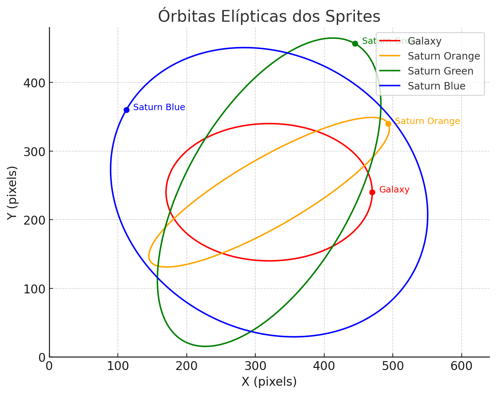
    
<figcaption>

**Figura 14** - Tragetória das órbitas dos corpos celestes que se movimentam no background
    </figcaption>
  </figure>
</div>

### Fluxo do Jogo

O jogo segue o fluxo descrito abaixo:
1. **Inicialização**:
   - Todas as threads e recursos são configurados no início do jogo.

2. **Execução**:
   - Threads lidam com movimentação, colisões e atualização da interface em paralelo.

3. **Pausa ou Encerramento**:
   - O jogador pode pausar ou terminar o jogo usando os botões físicos.

4. **Condição de Vitória ou Derrota**:
   - O jogo termina quando um jogador alcança 10 pontos ou perde todas as vidas.

#### **Criação e Finalização de Threads**
- Todas as threads são criadas na inicialização e pausadas ou finalizadas conforme necessário.
- Ao encerrar o jogo, as threads são finalizadas para liberar recursos.

#### **Diagrama do Fluxo do Jogo**
O diagrama abaixo descreve o fluxo de execução do jogo

<div align="center">
  <figure>  
    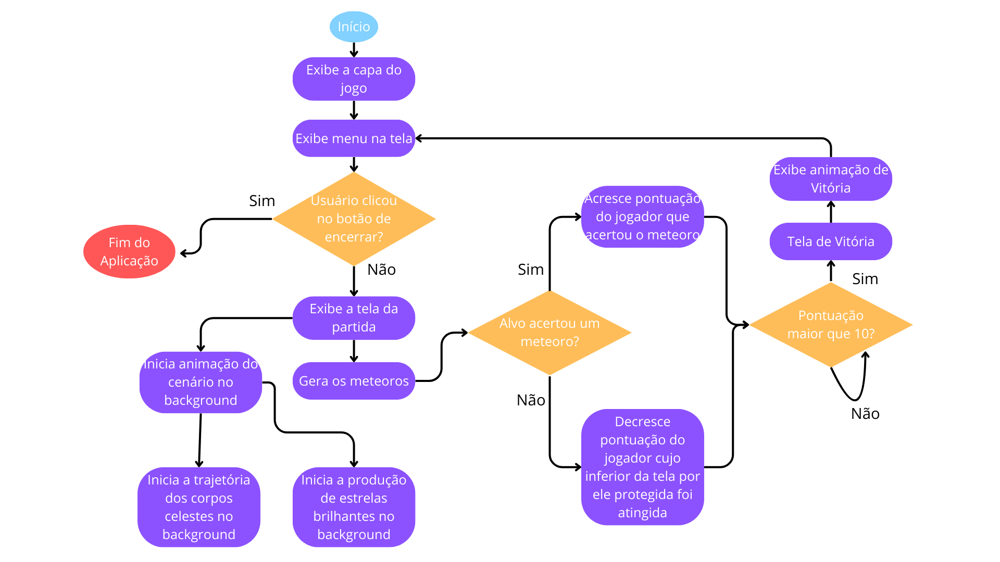
    
<figcaption>

**Figura 15** - Fluxo de execução do Jogo
    </figcaption>
  </figure>
</div>

Para garantir que o jogo responda aos comandos de maneira eficaz e com um bom aproveitamento do hardware, o software foi divido em threads. Cada thread possui uma reponsabilidade de maneira que uma não interfere diretamente no funcionamento de outra.
> O único momento que uma thread vem a interferir no funcionamento das demais é durante o acesso a variáveis compartilhadas

#### **Tabela de Threads Criadas e suas Responsabilidades**
A tabela abaixo descreve as threads criadas e suas responsabilidades:

Thread              |                  Responsabilidade
:----------------------|:-----------------------------
_Polling do mouse do jogador 1_| Realiza a leitura dos eventos do mouse e realiza o tratamento dessas entradas
_Polling do acelerômetro do jogador 2_| Realiza a leitura das aferições do acelerômetro e realiza o tratamento desses valores
_Atualização dos corpos celestes no background_ | Faz a atualização dos corpos celestes na tela para criar impressão de movimento
_Verificação de colisão_ | Responsavel por verificar a colisão e fazer a checagem de condição de vitória ou derrota
Geração de meteoros | Gera os meteoros na tela e faz a atualização de suas posições
_Menu_ | Menu do jogo, fica rodando durante o jogo realizando a captua das entradas dos botões da FPGA


## Testes

<details>
  <summary><b>Polling dos Botões</b></summary>

### Polling dos Botões

Foi utilizado *printf* para verificar se os botões estavam funcionando corretamente, com os estados sendo lidos e exibidos conforme esperado.

</details>

<details>
  <summary><b>Jogo</b></summary>

### Jogo

Foram realizados testes para verificar:
- Detecção e resposta a colisões.
- Atualização de pontuações.
- Funcionamento do menu e das animações.
- Controle dos alvos por mouse e acelerômetro.


<div align="center">
  <figure>  
    
    
<figcaption>

**Figura 16** - Atualização da pontuação ao destruir um meteoro
    </figcaption>
  </figure>
</div>

</details>


## Conclusão

O projeto atendeu a todos os requisitos, mas há espaço para melhorias, como:
- Aprimorar as animações para maior imersão.
- Adicionar novos níveis para aumentar o desafio.
- Explorar mais funcionalidades da GPU customizada.


